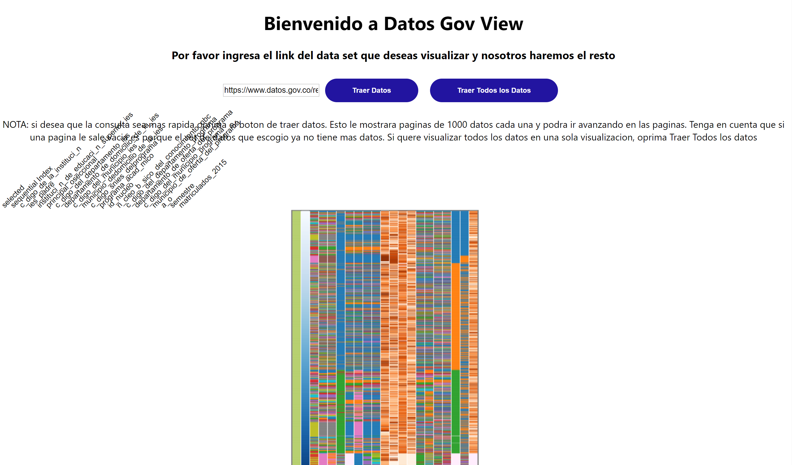

# datosGovViewer

This project was bootstrapped with [Create React App](https://github.com/facebook/create-react-app).

## Objective

This is a project that allows the  user to view datasets taken from https://datos.gov.co

## Used Tecnologies

This project uses React, npm, eslint, and navio.

## Available Scripts

In the project directory, you can run:

### `npm install`
Downloads all the dependencies.

### `npm start`

Runs the app in the development mode. 
Open [http://localhost:3000](http://localhost:3001) to view it in the browser.

### `npm run build`

Builds the app for production to the `/build` folder. 
It correctly bundles React in production mode and optimizes the build for the best performance.

The build is minified and the filenames include the hashes. 

## Deployment

You can find a deployed version of the project at https://datosgovview.herokuapp.com/

## Author

* [__Mateo Devia__](https://github.com/mateodevia)

## Message for the Teacher
This is a message exclusively to my web development teacher.

Hello John, I am sending this around 7:00pm on tuesday. Therefore, I am applying to the second deliverable version (exam+bonus+deployment). My creative component is the pages. When the user requests the dataset normally (just the first 1000 registers), I added extra buttons to navigate through the dataset. The "siguiente" and "anterior" buttons allow the user to query the next 1000 registers or the previous 1000 registers.

## License

This repository has the standard MIT license. You can find it [here.](https://github.com/mateodevia/datosGovViewer/blob/master/LICENSE)
